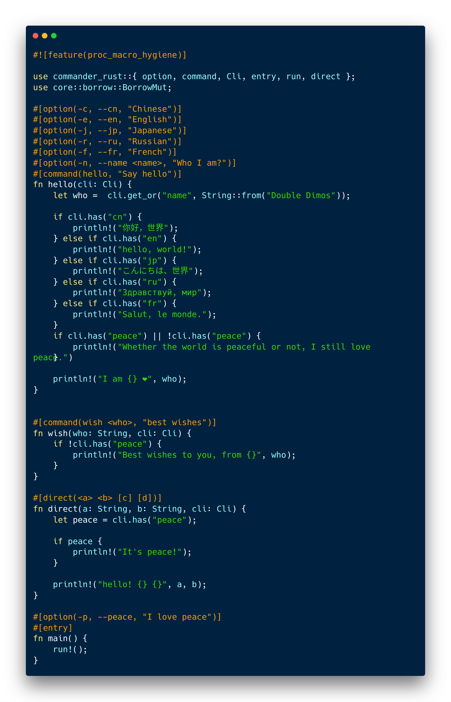

<p align="center">
	
    <br />
    <p align="center">snippet</p>
</p>


# other languages
[中文文档](https://github.com/MSDimos/commander-rust/blob/master/docs/README_CN.md)

# why this ?

For a long time, developing cli in `Rust` is difficult.
The community offers a wide range of solutions. Yes, they're excellent, but they're not very simple.

Inspired by [commander.js](https://github.com/tj/commander.js) & [rocket.rs](https://rocket.rs), the crate was born.


# features
+ API friendly
+ easy to use
+ support for approximate dynamic language
+ low performance loss
+ automatically support for `--version` & `--help`
+ automatically run corresponding commands

# limit

If you want to use this crate, please guarantee that you have follow rules below:
+ using `Rust 2018` (full proc macro support is required, including [proc_macro] & [proc_macro_attribute])
+ using `cargo` (`cargo` will produce some environment variable according to `Cargo.toml`, we need that)
+ be familiar with `Rust` (because it's developed for `Rust` )

As a reference, my versions are:
+ `cargo`: cargo 1.35.0-nightly (95b45eca1 2019-03-06)
+ `rustc`: rustc 1.35.0-nightly (e68bf8ae1 2019-03-11)
+ `Linux kernal`: 4.15.0-47-generic
+ `Ubuntu`: 16.04

# usage

#### install `commander-rust`

Two ways supported: from `Github` or `crates.io`.
The difference between them is that `Github` is latest but unstable and `crates.io` is stable but might not be latest.

##### install from `Github`

```toml
[dependencies.commander_rust]
git = "https://github.com/MSDimos/commander-rust"
branch = "master"
```

#### install from `crates.io`

```toml
[dependencies]
commander-rust = "1.1.3" # or other version you want to install
```

#### using it

We offer a simple but complete example, you can learn all through it.
Yes, That's all. Very easy!

```rust

// this is required! Beacuse we used `run!()`, it's a proc_macro
#![feature(proc_macro_hygiene)]

// Only five items you will use
use commander_rust::{ Cli, command, option, entry, run };


// what's option? what's command? 
// See `commander.js` and document of `commander-rust` for more!
// Note, types of parameters are not fixed, any type implemented `From<Raw>` is valid!
// So you can even use `rmdir(dir: i32, other_dirs: Vec<i32>, cli: Cli)` here.
// And `Cli` is not required! So you can miss it.
// See document of `commander-rust` for more details.
#[option(-s, --format <format>, "format output")]
#[option(-r, --recursive, "recursively")]
#[command(rmdir <dir> [otherDirs...], "remove files and directories")]
fn rmdir(dir: String, other_dirs: Option<Vec<String>>, cli: Cli) {

    // get value of no-parameter options, using `has`
    // get value if normal options, using `get`, `get_or`, `get_or_else`
    // `get_or` and `get_or_else` can be using for specifying default value 
    // for the most time, I suggest you using `get_or` and `has`.
    let format = cli.get_or("format", String::new("%s"));
    
    if !cli.has("recursive") {
        let silently = cli.get_or("silently", false);
        
        if silently {
            // delete all files silently
            // just like `rm -rf /`
        } else {
            // tell the world I'm going to delete the files
        }
    } else {
        // delete files recursively is slowly
        // so drink a cup of coffee, relax.
    }
}

// options here are public, options above `#[command]` are private
#[option(-s, --silently <silently>, "don't display anything")]
#[entry]
fn main() {
     // Run it now!!!!!
     let app = run!();
     // printing app is same as you inputting `--help`.
     println!("app is {:#?}", app);
}
```

#### try it

try to input `[pkg-name] --help`.

# version & description & cli-name?

`version`, `description`, `cli-name` of application are from `Cargo.toml`.

For instance:
```toml
# part of Cargo.toml
[package]
name = "example-test"
version = "0.1.0"
description = "Using for test"
```

# direct

If you don't want to define a sub-command, you can use `#[direct]`.
What's `direct`? In some situations, for instance, 
if you want to develop a CLI which could be called like `rm ./* -rf`. 
If there is no `direct`. you can only use sub-command, it looks like `rm delete ./* -rf`.
Come on! `delete` is redundant, we don't like this! It should be `rm -rf ./*` instead of `rm delete ./* -rf`.
So, it's time to use `#[direct]`.

```rust
/* 
    You can still define sub-command here
    suc-command can work together with direct-func well
 */

// function name is whatever you like
// last parameter can be `CLI`, it's not necessary like `command`.
// `cli` can only get public options here.
#[direct(<a> <b> [c] [d])]
fn whatever_you_like(a: String, b: String, cli: Cli) {
    println!("hello! {} {}", a, b);
}
```
Now, if you input `[pkg-name] 1 2 3`, cli will print `hello! 1 2`.
So it allows you that don't need to define a sub-command anymore in some simple situations. 
`direct` is supported by only `1.2.x` or higher. 
`direct` can work together with sub-command well, you can use them both together.

# error

I can't ensure that it will work perfectly in all cases.
My abilities are very limited, testing is not my skill and be sorry about that.
I'm learning it. So if you find any BUG, please tell me. Thanks.

# examples

Two full examples here. 
One is [cargo-bp](https://github.com/MSDimos/cargo-bp) and the other one is [hash](https://github.com/MSDimos/hash).
And there is a simple example showing all usage of `commander-rust`, see `./examples` for more information.

# homepage

Under development. See ./homepage

# rules

There are several rules you should follow.
1. All `#[options]` should defined above `#[command]` and `#[entry]`
2. DO NOT define options duplicate!!! As a concession, You can define the same option on different command and entry.
3. Private options are visible to specific sub-commands. Public options are visible to all sub-commands.


# warn

The crate is developed using `Ubuntu 16.04`, we can't assume that all platforms will work well.
If you find that it can't work well in other platforms, please tell me.

# contribute

Any useful contribute are welcome. You can send pull request to me.

# License

GPL-3.0. Because open source is future.
